# Package Dependencies

This diagram shows the internal package dependencies of Gopus.

```mermaid
%%{init: {'theme': 'base', 'themeVariables': { 'primaryColor': '#4a90d9', 'primaryTextColor': '#fff', 'primaryBorderColor': '#2d5986', 'lineColor': '#5c6bc0', 'secondaryColor': '#81c784', 'tertiaryColor': '#fff3e0'}}}%%
flowchart TB
    subgraph External["📦 External Dependencies"]
        direction LR
        yaml["gopkg.in/yaml.v3"]
        uuid["github.com/google/uuid"]
        oapi["oapi-codegen"]
        mcpgo["github.com/mark3labs/mcp-go"]
    end

    subgraph Main["🚀 Application Entry"]
        main["main.go"]
    end

    subgraph Internal["📁 internal/"]
        direction TB
        
        subgraph Core["⚙️ Core Services"]
            config["config
            ━━━━━━━━━━━━━━
            • Config struct
            • OpenAIConfig
            • SummarizationConfig
            • MCPConfig
            • Load/LoadDefault"]
            
            openai["openai
            ━━━━━━━━━━━━━━
            • ChatClient
            • ChatCompletion()
            • Generated types
            • API error handling"]
            
            mcp["mcp
            ━━━━━━━━━━━━━━
            • Manager
            • ToolInfo
            • AddServer()
            • CallTool()"]
        end
        
        subgraph Data["💾 Data Layer"]
            history["history
            ━━━━━━━━━━━━━━
            • Manager
            • Session
            • Message
            • Role/MessageType
            • Storage (JSON)"]
        end
        
        subgraph Features["✨ Features"]
            chat["chat
            ━━━━━━━━━━━━━━
            • ChatLoop
            • Run()
            • handleCommand()
            • /summarize, /stats
            • /sleep, /help
            • CircleAnimation"]
            
            summarize["summarize
            ━━━━━━━━━━━━━━
            • Summarizer
            • TierClassification
            • ProcessSession()
            • Auto-summarization"]
        end
        
        subgraph UI["🎨 UI Components"]
            canvas["canvas
            ━━━━━━━━━━━━━━
            • Canvas
            • Set/Clear/Toggle
            • Braille rendering
            • Pixel manipulation"]
            
            printer["printer
            ━━━━━━━━━━━━━━
            • PrintMessage()
            • PrintError()
            • ANSI colors"]
            
            animator["animator
            ━━━━━━━━━━━━━━
            • Animator
            • Animation interface
            • Start/Stop
            • Frame timing"]
            
            table["table
            ━━━━━━━━━━━━━━
            • Table
            • Column
            • Alignment
            • Render()"]
        end
        
        subgraph System["🔧 System"]
            signal["signal
            ━━━━━━━━━━━━━━
            • RunWithContext()
            • SIGINT/SIGTERM
            • Graceful shutdown"]
        end
    end

    %% Main dependencies
    main --> config
    main --> openai
    main --> history
    main --> chat
    main --> signal
    main --> mcp

    %% Chat dependencies
    chat --> config
    chat --> history
    chat --> openai
    chat --> printer
    chat --> summarize
    chat --> mcp
    chat --> animator
    chat --> canvas

    %% Summarize dependencies
    summarize --> config
    summarize --> history
    summarize --> openai

    %% History dependencies
    history --> uuid

    %% OpenAI dependencies
    openai --> config
    openai -.-> oapi

    %% MCP dependencies
    mcp --> mcpgo

    %% Config dependencies
    config --> yaml

    %% Styling
    classDef mainNode fill:#e91e63,stroke:#880e4f,stroke-width:3px,color:#fff
    classDef coreNode fill:#2196f3,stroke:#0d47a1,stroke-width:2px,color:#fff
    classDef dataNode fill:#4caf50,stroke:#1b5e20,stroke-width:2px,color:#fff
    classDef featureNode fill:#9c27b0,stroke:#4a148c,stroke-width:2px,color:#fff
    classDef uiNode fill:#ff9800,stroke:#e65100,stroke-width:2px,color:#fff
    classDef systemNode fill:#607d8b,stroke:#263238,stroke-width:2px,color:#fff
    classDef externalNode fill:#78909c,stroke:#37474f,stroke-width:1px,color:#fff

    class main mainNode
    class config,openai,mcp coreNode
    class history dataNode
    class chat,summarize featureNode
    class canvas,printer,animator,table uiNode
    class signal systemNode
    class yaml,uuid,oapi,mcpgo externalNode
```

## Package Descriptions

| Package | Purpose | Key Types |
|---------|---------|-----------|
| **main** | Application entry point, orchestrates startup | - |
| **config** | YAML configuration loading with defaults | `Config`, `OpenAIConfig`, `SummarizationConfig`, `MCPConfig` |
| **openai** | OpenAI API client (generated via oapi-codegen) | `ChatClient`, `ChatCompletionRequestMessage` |
| **mcp** | MCP server management using mark3labs/mcp-go | `Manager`, `ToolInfo` |
| **history** | Persistent session management with JSON storage | `Manager`, `Session`, `Message`, `Role` |
| **chat** | Interactive chat loop with slash commands | `ChatLoop`, `CircleAnimation` |
| **summarize** | Tiered message summarization (condensed → compressed) | `Summarizer`, `TierClassification`, `Stats` |
| **canvas** | Braille-based terminal drawing canvas | `Canvas` |
| **printer** | ANSI-colored terminal output | `PrintMessage()`, `PrintError()` |
| **animator** | Animation timing and lifecycle management | `Animator`, `Animation` |
| **table** | Terminal table rendering with column alignment | `Table`, `Column`, `Alignment` |
| **signal** | OS signal handling for graceful shutdown | `RunWithContext()` |
