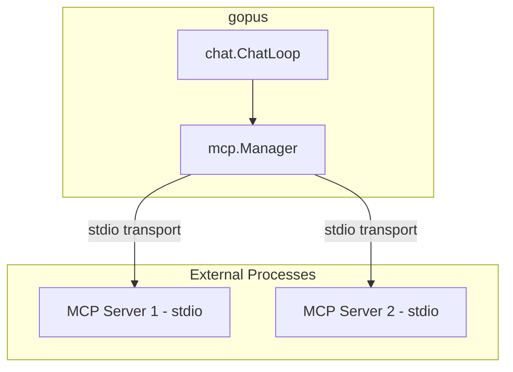
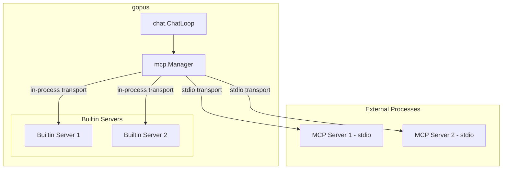
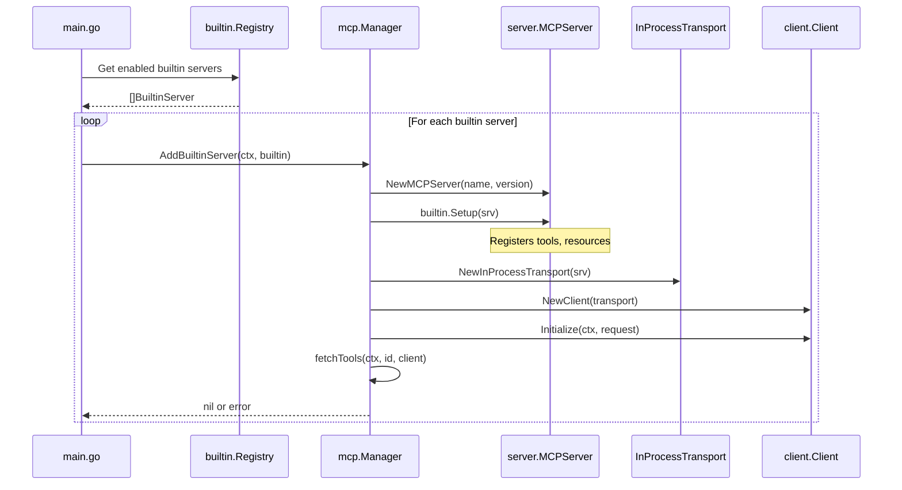

# Builtin MCP Servers Plan

## Overview

Add support for in-process MCP servers using the `mcp-go` library's server functionality. This allows embedding Go-based MCP tools directly in the gopus binary without needing external processes.

## Current Architecture



### Current Implementation

- [`internal/mcp/manager.go`](../internal/mcp/manager.go:1) - Manages MCP server connections via stdio transport
- [`Manager.AddServer()`](../internal/mcp/manager.go:121) - Connects to external MCP servers using `client.NewStdioMCPClient()`
- [`config.MCPServerConfig`](../internal/config/config.go:54) - Configures external servers with command, args, env

## Proposed Architecture



## Key Components

### 1. BuiltinServer Interface

Define an interface that builtin servers must implement:

```go
// BuiltinServer defines the interface for in-process MCP servers.
type BuiltinServer interface {
    // Name returns the unique identifier for this server.
    Name() string
    
    // Description returns a human-readable description.
    Description() string
    
    // Setup configures the MCP server with tools, resources, etc.
    // Called once when the server is registered.
    Setup(srv *server.MCPServer) error
}
```

### 2. Extended Manager

Extend the existing [`Manager`](../internal/mcp/manager.go:96) to support both transport types:

```go
type Manager struct {
    mu             sync.RWMutex
    clients        map[string]*client.Client  // All clients - both stdio and in-process
    tools          map[string]ToolInfo
    debug          bool
    builtinServers map[string]*server.MCPServer  // Track in-process servers
}
```

### 3. AddBuiltinServer Method

New method to register in-process servers:

```go
// AddBuiltinServer registers an in-process MCP server.
func (m *Manager) AddBuiltinServer(ctx context.Context, builtin BuiltinServer) error {
    // 1. Create MCPServer using server.NewMCPServer()
    // 2. Call builtin.Setup() to configure tools
    // 3. Create in-process transport using transport.NewInProcessTransport()
    // 4. Create client using client.NewClient()
    // 5. Initialize and register tools
}
```

### 4. Builtin Server Registry

Create a registry pattern for discovering and enabling builtin servers:

```go
// internal/mcp/builtin/registry.go

// Registry holds all available builtin servers.
type Registry struct {
    servers map[string]BuiltinServer
}

// Register adds a builtin server to the registry.
func (r *Registry) Register(srv BuiltinServer) {
    r.servers[srv.Name()] = srv
}

// Get returns a builtin server by name.
func (r *Registry) Get(name string) (BuiltinServer, bool) {
    srv, ok := r.servers[name]
    return srv, ok
}

// All returns all registered builtin servers.
func (r *Registry) All() []BuiltinServer {
    // ...
}

// DefaultRegistry is the global registry instance.
var DefaultRegistry = &Registry{servers: make(map[string]BuiltinServer)}
```

### 5. Configuration Updates

Extend [`MCPConfig`](../internal/config/config.go:46) to support builtin servers:

```go
type MCPConfig struct {
    ToolConfirmation string            `yaml:"tool_confirmation"`
    DefaultTimeout   int               `yaml:"default_timeout"`
    Debug            bool              `yaml:"debug"`
    Servers          []MCPServerConfig `yaml:"servers"`
    Builtin          BuiltinConfig     `yaml:"builtin"`  // NEW
}

type BuiltinConfig struct {
    // List of builtin server names to enable
    // If empty, all builtin servers are enabled
    Enabled []string `yaml:"enabled"`
    
    // List of builtin server names to disable
    Disabled []string `yaml:"disabled"`
}
```

Example config:

```yaml
mcp:
  builtin:
    # Enable specific builtin servers - if empty, all are enabled
    enabled: []
    # Disable specific builtin servers
    disabled:
      - example  # Disable the example server
```

## Implementation Steps

### Step 1: Create BuiltinServer Interface

Create `internal/mcp/builtin.go`:
- Define `BuiltinServer` interface
- Define `Registry` type with `Register()`, `Get()`, `All()` methods
- Create `DefaultRegistry` global instance

### Step 2: Extend Manager

Modify `internal/mcp/manager.go`:
- Add `builtinServers` field to track in-process servers
- Add `AddBuiltinServer()` method using in-process transport
- Ensure `Close()` properly cleans up in-process servers

### Step 3: Update Configuration

Modify `internal/config/config.go`:
- Add `BuiltinConfig` struct
- Add `Builtin` field to `MCPConfig`
- Add defaults in `applyMCPDefaults()`

### Step 4: Update Initialization

Modify `main.go`:
- After creating MCP manager, register enabled builtin servers
- Use registry to discover available builtin servers
- Respect enabled/disabled configuration

### Step 5: Create Example Builtin Server

Create `internal/mcp/builtin/example.go`:
- Implement a simple example server with one tool
- Register it with `DefaultRegistry` using `init()`
- Serves as documentation and template for future servers

### Step 6: Update Documentation

Update `config.example.yaml`:
- Add builtin configuration section with comments
- Document available builtin servers

Update `AGENTS.md`:
- Document the builtin server pattern
- Explain how to add new builtin servers

## File Changes Summary

| File | Change Type | Description |
|------|-------------|-------------|
| `internal/mcp/builtin.go` | New | BuiltinServer interface and Registry |
| `internal/mcp/manager.go` | Modify | Add AddBuiltinServer method |
| `internal/config/config.go` | Modify | Add BuiltinConfig struct |
| `internal/mcp/builtin/example.go` | New | Example builtin server |
| `main.go` | Modify | Initialize builtin servers |
| `config.example.yaml` | Modify | Document builtin config |
| `AGENTS.md` | Modify | Document builtin pattern |

## Usage Example

After implementation, adding a new builtin server would look like:

```go
// internal/mcp/builtin/myserver.go
package builtin

import (
    "context"
    
    "github.com/mark3labs/mcp-go/mcp"
    "github.com/mark3labs/mcp-go/server"
    
    mcpinternal "gopus/internal/mcp"
)

func init() {
    mcpinternal.DefaultRegistry.Register(&MyServer{})
}

type MyServer struct{}

func (s *MyServer) Name() string        { return "myserver" }
func (s *MyServer) Description() string { return "My custom MCP server" }

func (s *MyServer) Setup(srv *server.MCPServer) error {
    // Define a tool
    tool := mcp.NewTool("my_tool",
        mcp.WithDescription("Does something useful"),
        mcp.WithString("input", mcp.Required(), mcp.Description("Input value")),
    )
    
    // Add tool with handler
    srv.AddTool(tool, func(ctx context.Context, req mcp.CallToolRequest) (*mcp.CallToolResult, error) {
        input := req.Params.Arguments["input"].(string)
        return mcp.NewToolResultText("Processed: " + input), nil
    })
    
    return nil
}
```

## Sequence Diagram



## Testing Strategy

1. **Unit Tests**: Test `Registry` methods and `AddBuiltinServer` logic
2. **Integration Tests**: Test that builtin tools are callable through the chat loop
3. **Example Server**: The example server serves as a living test

## Open Questions

1. **Should builtin servers support hot-reload?** - Probably not needed for v1
2. **Should builtin servers have access to app context?** - Could pass config/dependencies via Setup context
3. **Naming convention for builtin servers?** - Suggest `gopus-*` prefix to distinguish from external servers
