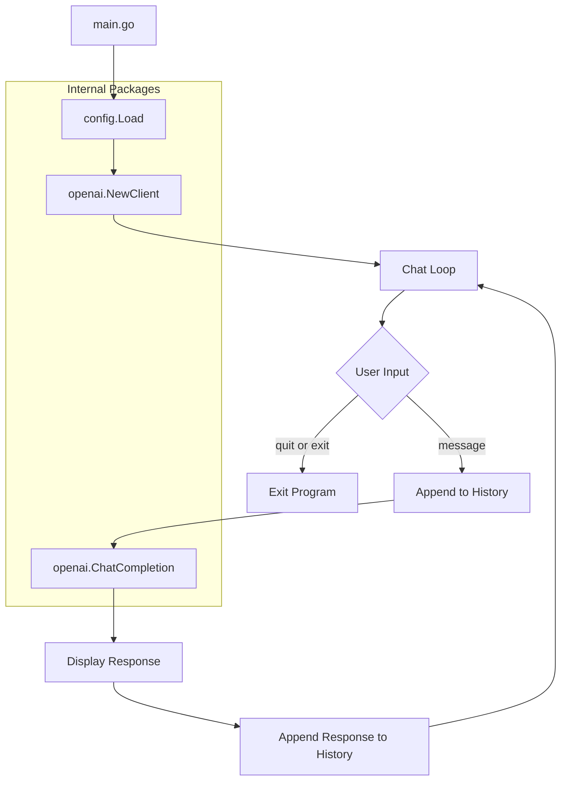

# Go OpenAI Chat Application - Architecture Plan

## Overview

A simple Go command-line application that interacts with the OpenAI `/chat/completions` endpoint, featuring:
- Configuration file-based API key management
- Conversation history tracking within a session
- Basic interactive chat loop (type "quit" or "exit" to end)

## Project Structure

```
gopus/
├── go.mod                    # Go module definition
├── go.sum                    # Dependency checksums
├── config.yaml               # Configuration file (user creates this)
├── config.example.yaml       # Example configuration template
├── README.md                 # Usage documentation
├── main.go                   # Application entry point with chat loop
├── internal/
│   ├── config/
│   │   └── config.go         # Configuration loading and validation
│   └── openai/
│       ├── client.go         # OpenAI API client with ChatCompletion
│       └── types.go          # Request/Response types
└── plans/
    └── chat-app-plan.md      # This plan file
```

## Architecture Diagram



## Component Details

### 1. Configuration Package - `internal/config/config.go`

**Responsibilities:**
- Load configuration from YAML file
- Validate required fields (API key)
- Provide sensible defaults for optional fields

**Configuration Structure:**
```yaml
openai:
  api_key: "sk-..."
  model: "gpt-3.5-turbo"       # default: gpt-3.5-turbo
  max_tokens: 1000             # default: 1000
  temperature: 0.7             # default: 0.7
  base_url: "https://api.openai.com/v1"  # optional, for proxies
```

**Key Functions:**
- `Load(path string) (*Config, error)` - Load and validate config
- `LoadDefault() (*Config, error)` - Load from default path ./config.yaml

### 2. OpenAI Client Package - `internal/openai/`

**Files:**

#### `types.go` - API Types
```go
type Message struct {
    Role    string `json:"role"`    // system, user, assistant
    Content string `json:"content"`
}

type ChatRequest struct {
    Model       string    `json:"model"`
    Messages    []Message `json:"messages"`
    MaxTokens   int       `json:"max_tokens,omitempty"`
    Temperature float64   `json:"temperature,omitempty"`
}

type ChatResponse struct {
    ID      string   `json:"id"`
    Choices []Choice `json:"choices"`
    Usage   Usage    `json:"usage"`
    Error   *APIError `json:"error,omitempty"`
}

type Choice struct {
    Index        int     `json:"index"`
    Message      Message `json:"message"`
    FinishReason string  `json:"finish_reason"`
}

type Usage struct {
    PromptTokens     int `json:"prompt_tokens"`
    CompletionTokens int `json:"completion_tokens"`
    TotalTokens      int `json:"total_tokens"`
}

type APIError struct {
    Message string `json:"message"`
    Type    string `json:"type"`
}
```

#### `client.go` - HTTP Client and Chat Completion
```go
type Client struct {
    apiKey      string
    baseURL     string
    httpClient  *http.Client
    model       string
    maxTokens   int
    temperature float64
}

func NewClient(cfg *config.Config) *Client
func (c *Client) ChatCompletion(ctx context.Context, messages []Message) (*ChatResponse, error)
```

### 3. Main Program - `main.go`

**Responsibilities:**
- Load configuration
- Maintain conversation history as a slice of messages
- Run the interactive chat loop
- Handle graceful shutdown on Ctrl+C

**Flow:**
1. Load configuration from `config.yaml`
2. Create OpenAI client
3. Initialize empty conversation history slice
4. Enter interactive loop:
   - Display prompt `You: `
   - Read user input using bufio.Scanner
   - Check for exit: `quit` or `exit` (case-insensitive)
   - Add user message to history
   - Send conversation to OpenAI API
   - Display assistant response prefixed with `Assistant: `
   - Add assistant response to history
5. Handle Ctrl+C for graceful shutdown

## Dependencies

```go
require (
    gopkg.in/yaml.v3 v3.0.1  // YAML parsing for config
)
```

Note: We will use the standard library for HTTP requests rather than an OpenAI SDK to keep dependencies minimal and demonstrate direct API usage.

## Error Handling Strategy

1. **Configuration Errors**: Exit with clear message about missing/invalid config
2. **API Errors**: Display error message but continue chat loop
3. **Interrupt Signal**: Graceful shutdown with goodbye message

## Security Considerations

1. Config file should be in `.gitignore`
2. API key never logged or displayed
3. Example config provided without real keys

## Implementation Order

1. Create `go.mod` with module name `gopus`
2. Create `config.example.yaml` template
3. Implement `internal/config/config.go`
4. Implement `internal/openai/types.go`
5. Implement `internal/openai/client.go`
6. Implement `main.go` with chat loop and history
7. Create `README.md`
8. Create `.gitignore`

## Sample Interaction

```
$ go run main.go
Loading configuration from config.yaml...
Connected to OpenAI. Type 'quit' or 'exit' to end the conversation.

You: Hello! What can you help me with?
Assistant: Hello! I'm an AI assistant and I can help you with a wide variety of tasks...

You: Can you explain what Go interfaces are?
Assistant: Go interfaces are a powerful feature that define a set of method signatures...

You: quit
Goodbye!
```
