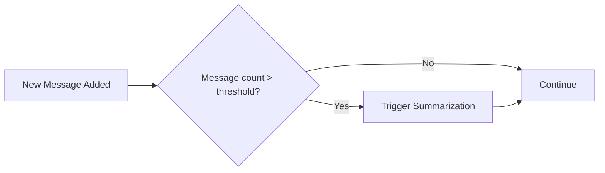
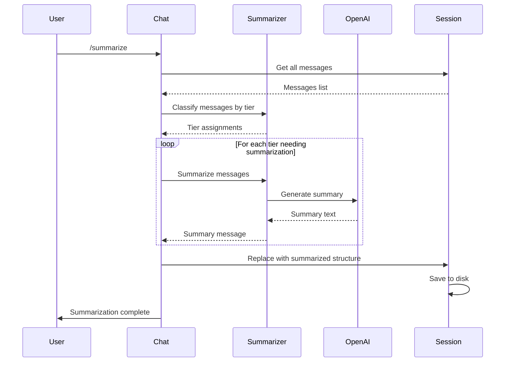

# Eternal Chat History with Progressive Summarization

## Overview

Implement an "eternal" chat history system that progressively summarizes older messages to manage context window limits while preserving long-term memory.

## Design Decisions

Based on user requirements:
- **Summarization Tiers**: Message-count based (Last 20 full → Next 50 condensed → Rest highly compressed)
- **Trigger**: Both on-demand (`/summarize` command) AND automatic (when thresholds exceeded)
- **Storage**: In-place replacement of original messages with summaries

## Architecture

```mermaid
flowchart TD
    subgraph Session
        M1[Recent Messages - Full Detail]
        M2[Medium-term - Condensed Summary]
        M3[Long-term - Highly Compressed]
    end
    
    subgraph Triggers
        CMD[/summarize command]
        AUTO[Auto-trigger on threshold]
    end
    
    subgraph Summarization Flow
        TIER[Tier Classifier]
        SUM[Summarization Service]
        SAVE[Save Session]
    end
    
    CMD --> TIER
    AUTO --> TIER
    TIER --> SUM
    SUM --> SAVE
    SAVE --> Session
```

## Trigger Modes

### On-Demand Mode
User explicitly runs `/summarize` command to trigger summarization.

### Automatic Mode
Summarization triggers automatically when:
- Total message count exceeds `auto_threshold` (e.g., 100 messages)
- Checked after each new message is added
- Can be disabled via config (`auto_summarize: false`)



## Data Model Changes

### Updated Message Struct

```go
// MessageType distinguishes between regular messages and summaries
type MessageType string

const (
    TypeMessage  MessageType = "message"
    TypeSummary  MessageType = "summary"
)

// SummaryLevel indicates the compression level
type SummaryLevel string

const (
    LevelCondensed  SummaryLevel = "condensed"   // Medium compression
    LevelCompressed SummaryLevel = "compressed"  // High compression
)

// Message represents a chat message or summary in the history
type Message struct {
    Role         Role         `json:"role"`
    Content      string       `json:"content"`
    Type         MessageType  `json:"type,omitempty"`         // message or summary
    SummaryLevel SummaryLevel `json:"summary_level,omitempty"` // only for summaries
    MessageCount int          `json:"message_count,omitempty"` // messages summarized
    CreatedAt    time.Time    `json:"created_at,omitempty"`
}
```

### Tier Configuration

```go
// SummarizationConfig holds tier thresholds
type SummarizationConfig struct {
    RecentCount    int // Messages to keep in full detail (default: 20)
    CondensedCount int // Messages to condense (default: 50)
    // Everything older gets highly compressed
}
```

## Summarization Tiers

| Tier | Message Range | Compression | Description |
|------|---------------|-------------|-------------|
| Recent | Last 20 | None | Full message content preserved |
| Condensed | Next 50 | Medium | Key points and context preserved |
| Compressed | Older | High | Essential facts only |

## Summarization Process



## Implementation Plan

### 1. Update Message Struct
- Add `Type`, `SummaryLevel`, `MessageCount`, and `CreatedAt` fields
- Ensure backward compatibility with existing sessions (default Type to "message")

### 2. Create Summarization Service
New file: `internal/summarize/summarize.go`

```go
type Summarizer struct {
    client *openai.ChatClient
    config SummarizationConfig
}

func (s *Summarizer) SummarizeMessages(messages []history.Message, level SummaryLevel) (history.Message, error)
func (s *Summarizer) ClassifyTiers(messages []history.Message) (recent, toCondense, toCompress []history.Message)
func (s *Summarizer) ProcessSession(session *history.Session) error
```

### 3. Add /summarize Command
Update `internal/chat/chat.go` to handle the `/summarize` command:
- Parse command from user input
- Call summarization service
- Display progress and results

### 4. Update Context Building
Modify how messages are sent to OpenAI:
- Include compressed summaries as system context
- Include condensed summaries as assistant messages
- Include recent messages in full

### 5. Configuration
Add to `config.yaml`:
```yaml
summarization:
  enabled: true
  recent_count: 20        # Messages to keep in full detail
  condensed_count: 50     # Messages to condense before compressing
  auto_summarize: true    # Enable automatic summarization
  auto_threshold: 100     # Trigger auto-summarization when message count exceeds this
```

### 6. Implement Automatic Summarization
- Add threshold check in `Manager.AddMessage()`
- When message count exceeds `auto_threshold`, trigger summarization
- Show brief notification to user when auto-summarization occurs
- Respect `auto_summarize` config flag

## Prompts for Summarization

### Condensed Summary Prompt
```
Summarize the following conversation, preserving:
- Key topics discussed
- Important decisions or conclusions
- Relevant context for future conversations

Keep the summary concise but informative.
```

### Compressed Summary Prompt
```
Create a highly compressed summary of this conversation history.
Include only:
- Main topics covered
- Critical facts or decisions
- Essential context

Be extremely brief - this is long-term memory.
```

## File Changes Summary

| File | Change |
|------|--------|
| `internal/history/message.go` | Add Type, SummaryLevel, MessageCount, CreatedAt fields |
| `internal/summarize/summarize.go` | New file - summarization service |
| `internal/chat/chat.go` | Add /summarize command handling |
| `internal/config/config.go` | Add summarization config options |
| `config.example.yaml` | Add summarization section |

## Edge Cases

1. **Empty session**: No-op, inform user
2. **Already summarized**: Re-summarize or skip based on message count
3. **API errors during summarization**: Rollback, preserve original messages
4. **Very long messages**: May need chunking for summarization

## Future Enhancements

- View original messages before summarization (archive mode)
- Configurable summarization prompts
- Token-based tier calculation instead of message count
- Smarter summarization that preserves code snippets and technical details
