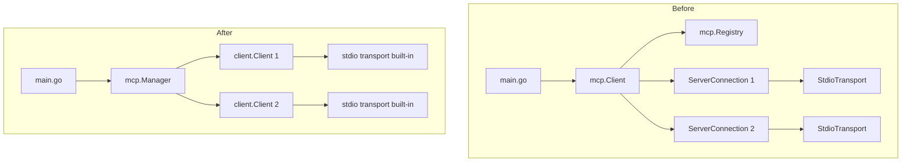

# MCP Migration Plan: Replace Custom Implementation with mark3labs/mcp-go

## Overview

This plan outlines the migration from the custom MCP (Model Context Protocol) implementation in `internal/mcp/` to the well-maintained `github.com/mark3labs/mcp-go` library.

## Current Implementation Analysis

### Files to Replace

| File | Lines | Purpose |
|------|-------|---------|
| `internal/mcp/client.go` | 370 | Main client managing server connections, tool calls |
| `internal/mcp/protocol.go` | 211 | JSON-RPC protocol types and methods |
| `internal/mcp/registry.go` | 119 | Tool registry aggregating tools from servers |
| `internal/mcp/transport.go` | 46 | Transport interface definition |
| `internal/mcp/transport_stdio.go` | 272 | Stdio transport implementation |
| `internal/mcp/types.go` | 131 | MCP type definitions |

**Total: ~1,149 lines of custom code to replace**

### Current API Surface Used

From `main.go`:
```go
mcp.DefaultClientConfig()
mcp.NewClient(clientConfig)
mcp.NewStdioTransport(mcp.StdioConfig{...})
mcpClient.AddServer(ctx, serverCfg.Name, transport)
mcpClient.Registry().ListTools()
mcpClient.Close()
```

From `internal/chat/chat.go`:
```go
mcpClient.Registry().ListTools()
mcpClient.CallTool(ctx, toolCall.Function.Name, args)
mcp.ToolContent  // type for tool results
```

## mark3labs/mcp-go Library API

### Key Imports
```go
import (
    "github.com/mark3labs/mcp-go/client"
    "github.com/mark3labs/mcp-go/mcp"
)
```

### Client Creation
```go
// NewStdioMCPClient creates a stdio-based MCP client
c, err := client.NewStdioMCPClient(
    command,      // string: command to run
    env,          // []string: environment variables
    args...,      // ...string: command arguments
)
defer c.Close()
```

### Initialization
```go
initRequest := mcp.InitializeRequest{}
initRequest.Params.ProtocolVersion = mcp.LATEST_PROTOCOL_VERSION
initRequest.Params.ClientInfo = mcp.Implementation{
    Name:    "gopus",
    Version: "1.0.0",
}

initResult, err := c.Initialize(ctx, initRequest)
```

### List Tools
```go
toolsRequest := mcp.ListToolsRequest{}
tools, err := c.ListTools(ctx, toolsRequest)
// tools.Tools is []mcp.Tool
```

### Call Tool
```go
callRequest := mcp.CallToolRequest{}
callRequest.Params.Name = "tool_name"
callRequest.Params.Arguments = map[string]any{
    "arg1": "value1",
}

result, err := c.CallTool(ctx, callRequest)
// result.Content is []mcp.Content
```

## Architecture Changes

### Before: Multi-Server Architecture
```
mcp.Client
  ├── servers map[string]*ServerConnection
  ├── registry *Registry (aggregates tools)
  └── Each server has its own transport
```

### After: Single-Client-Per-Server Architecture
```
MCPManager (new wrapper)
  ├── clients map[string]*client.Client
  ├── tools map[string]ToolInfo (tool name -> server + tool)
  └── Each client is a direct mcp-go client
```

## Migration Diagram



## Implementation Steps

### Step 1: Add Dependency
```bash
go get github.com/mark3labs/mcp-go
```

### Step 2: Create New MCP Manager

Create `internal/mcp/manager.go` - a thin wrapper that:
- Manages multiple mcp-go clients (one per server)
- Aggregates tools from all servers
- Provides a unified interface for the chat loop

```go
package mcp

import (
    "context"
    "encoding/json"
    "fmt"
    "sync"

    "github.com/mark3labs/mcp-go/client"
    mcplib "github.com/mark3labs/mcp-go/mcp"
)

// ToolInfo contains tool metadata with server association
type ToolInfo struct {
    Tool     mcplib.Tool
    ServerID string
    Client   *client.Client
}

// Manager manages multiple MCP server connections
type Manager struct {
    mu      sync.RWMutex
    clients map[string]*client.Client
    tools   map[string]ToolInfo
}

// NewManager creates a new MCP manager
func NewManager() *Manager {
    return &Manager{
        clients: make(map[string]*client.Client),
        tools:   make(map[string]ToolInfo),
    }
}

// AddServer connects to an MCP server via stdio
func (m *Manager) AddServer(ctx context.Context, id, command string, env []string, args ...string) error

// ListTools returns all available tools
func (m *Manager) ListTools() []mcplib.Tool

// CallTool executes a tool by name
func (m *Manager) CallTool(ctx context.Context, name string, arguments map[string]any) (*mcplib.CallToolResult, error)

// Close closes all client connections
func (m *Manager) Close() error
```

### Step 3: Update main.go

Replace `initMCPClient` function:

```go
func initMCPClient(ctx context.Context, mcpCfg config.MCPConfig) (*mcp.Manager, error) {
    manager := mcp.NewManager()
    
    for _, serverCfg := range mcpCfg.Servers {
        if !serverCfg.Enabled {
            continue
        }
        
        // Convert env map to slice
        var envSlice []string
        for k, v := range serverCfg.Env {
            envSlice = append(envSlice, fmt.Sprintf("%s=%s", k, v))
        }
        
        if err := manager.AddServer(ctx, serverCfg.Name, serverCfg.Command, envSlice, serverCfg.Args...); err != nil {
            fmt.Fprintf(os.Stderr, "Warning: Failed to connect to MCP server %q: %v\n", serverCfg.Name, err)
            continue
        }
    }
    
    return manager, nil
}
```

### Step 4: Update chat.go

Update the ChatLoop struct and methods:

```go
type ChatLoop struct {
    client         *openai.ChatClient
    historyManager *history.Manager
    summarizer     *summarize.Summarizer
    mcpManager     *mcp.Manager  // Changed from *mcp.Client
    config         *config.Config
}

// getOpenAITools converts MCP tools to OpenAI format
func (c *ChatLoop) getOpenAITools() []openai.ChatCompletionTool {
    if c.mcpManager == nil {
        return nil
    }
    
    mcpTools := c.mcpManager.ListTools()
    // ... rest of conversion logic
}

// executeToolCall executes a single tool call via MCP
func (c *ChatLoop) executeToolCall(ctx context.Context, toolCall openai.ChatCompletionMessageToolCall) (string, error) {
    // Parse arguments
    var args map[string]any
    if toolCall.Function.Arguments != "" {
        if err := json.Unmarshal([]byte(toolCall.Function.Arguments), &args); err != nil {
            return "", fmt.Errorf("failed to parse arguments: %w", err)
        }
    }
    
    result, err := c.mcpManager.CallTool(ctx, toolCall.Function.Name, args)
    // ... handle result
}
```

### Step 5: Remove Old Files

Delete the following files:
- `internal/mcp/client.go`
- `internal/mcp/protocol.go`
- `internal/mcp/registry.go`
- `internal/mcp/transport.go`
- `internal/mcp/transport_stdio.go`
- `internal/mcp/types.go`

### Step 6: Update go.mod

```bash
go mod tidy
```

## Type Mapping

| Current Type | mcp-go Type |
|--------------|-------------|
| `mcp.Tool` | `mcp.Tool` |
| `mcp.ToolContent` | `mcp.Content` |
| `mcp.ToolResult` | `mcp.CallToolResult` |
| `mcp.ClientInfo` | `mcp.Implementation` |
| `mcp.ServerInfo` | `mcp.Implementation` |
| `mcp.ServerCapabilities` | `mcp.ServerCapabilities` |

## Benefits of Migration

1. **Reduced Maintenance**: ~1,149 lines of custom code replaced by well-tested library
2. **Protocol Updates**: Automatic support for new MCP protocol versions
3. **Better Error Handling**: Library provides typed errors and better diagnostics
4. **Community Support**: Active development with 8.2k stars, 152 contributors
5. **Additional Features**: SSE transport, HTTP transport, elicitation support

## Risks and Mitigations

| Risk | Mitigation |
|------|------------|
| API differences | Create thin wrapper to maintain similar interface |
| Breaking changes in library | Pin to specific version in go.mod |
| Missing features | Library is feature-complete for our use case |

## Testing Plan

1. Unit test the new Manager wrapper
2. Integration test with a real MCP server (e.g., filesystem server)
3. Verify tool listing works correctly
4. Verify tool execution works correctly
5. Test error handling scenarios
6. Test multi-server configuration

## Rollback Plan

If issues arise:
1. Revert go.mod changes
2. Restore deleted files from git
3. Revert main.go and chat.go changes

All changes can be reverted with a single `git revert` of the migration commit.
