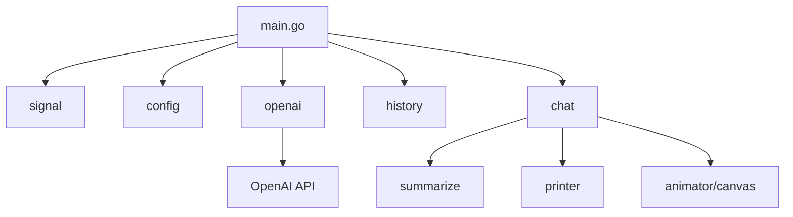
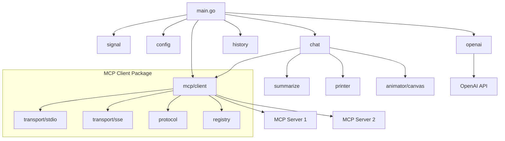
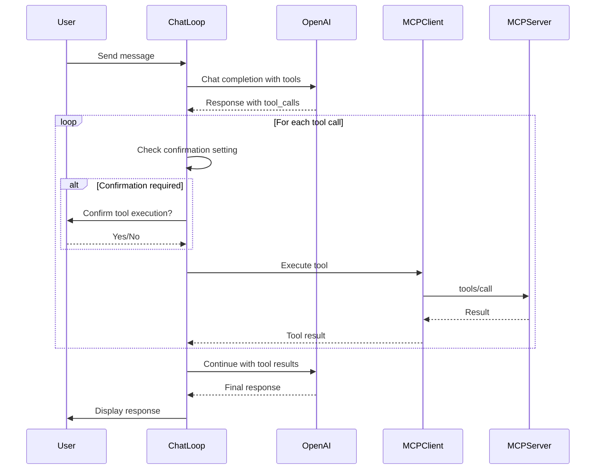

# MCP Support Plan for Gopus

## Overview

This plan adds Model Context Protocol (MCP) **Client** support to Gopus, enabling it to connect to external MCP servers and use their tools during chat conversations.

> **Note:** MCP Server support (exposing Gopus capabilities to other clients) is planned for a future phase.

## Current Architecture



## Phase 1: MCP Client Implementation

### 1.1 Architecture Changes



### 1.2 New Package: `internal/mcp`

#### Directory Structure

```
internal/mcp/
├── client.go           # MCP client manager - connects to multiple servers
├── protocol.go         # JSON-RPC message types and MCP protocol types
├── transport.go        # Transport interface
├── transport_stdio.go  # Stdio transport implementation
├── transport_sse.go    # SSE transport implementation (future)
├── registry.go         # Tool registry - aggregates tools from all servers
├── executor.go         # Tool execution with confirmation logic
└── types.go            # Shared types (Tool, Resource, etc.)
```

#### Key Types

```go
// Tool represents an MCP tool definition
type Tool struct {
    Name        string          `json:"name"`
    Description string          `json:"description"`
    InputSchema json.RawMessage `json:"inputSchema"`
    ServerID    string          // Which server provides this tool
}

// ToolCall represents a request to execute a tool
type ToolCall struct {
    ID        string          `json:"id"`
    Name      string          `json:"name"`
    Arguments json.RawMessage `json:"arguments"`
}

// ToolResult represents the result of a tool execution
type ToolResult struct {
    ToolCallID string `json:"tool_call_id"`
    Content    string `json:"content"`
    IsError    bool   `json:"is_error"`
}

// Client manages connections to MCP servers
type Client struct {
    servers  map[string]*ServerConnection
    registry *Registry
    config   *MCPConfig
}

// Registry aggregates tools from all connected servers
type Registry struct {
    tools map[string]Tool // tool name -> tool definition
}
```

### 1.3 OpenAPI Schema Changes

The OpenAI API schema needs to be extended to support function calling. Add to [`internal/openai/openapi.yaml`](internal/openai/openapi.yaml:1):

```yaml
# Add to CreateChatCompletionRequest properties:
tools:
  type: array
  description: A list of tools the model may call
  items:
    $ref: '#/components/schemas/ChatCompletionTool'

tool_choice:
  description: Controls which tool is called by the model
  oneOf:
    - type: string
      enum: [none, auto]
    - $ref: '#/components/schemas/ChatCompletionToolChoice'

# Add to ChatCompletionRequestMessage:
tool_calls:
  type: array
  items:
    $ref: '#/components/schemas/ChatCompletionMessageToolCall'

tool_call_id:
  type: string
  description: Tool call ID for tool role messages

# Add new role:
# In ChatCompletionRequestMessageRole enum, add: tool

# New schemas:
ChatCompletionTool:
  type: object
  required:
    - type
    - function
  properties:
    type:
      type: string
      enum: [function]
    function:
      $ref: '#/components/schemas/FunctionDefinition'

FunctionDefinition:
  type: object
  required:
    - name
  properties:
    name:
      type: string
    description:
      type: string
    parameters:
      type: object
      additionalProperties: true

ChatCompletionMessageToolCall:
  type: object
  required:
    - id
    - type
    - function
  properties:
    id:
      type: string
    type:
      type: string
      enum: [function]
    function:
      type: object
      required:
        - name
        - arguments
      properties:
        name:
          type: string
        arguments:
          type: string

ChatCompletionToolChoice:
  type: object
  required:
    - type
    - function
  properties:
    type:
      type: string
      enum: [function]
    function:
      type: object
      required:
        - name
      properties:
        name:
          type: string
```

### 1.4 Configuration Changes

Add to [`internal/config/config.go`](internal/config/config.go:1):

```go
// MCPConfig contains MCP client settings
type MCPConfig struct {
    Enabled           bool              `yaml:"enabled"`
    Servers           []MCPServerConfig `yaml:"servers"`
    ToolConfirmation  string            `yaml:"tool_confirmation"` // "always", "never", "ask"
    DefaultTimeout    int               `yaml:"default_timeout"`   // seconds
}

// MCPServerConfig defines an MCP server connection
type MCPServerConfig struct {
    Name      string            `yaml:"name"`      // Unique identifier
    Command   string            `yaml:"command"`   // Command to start server
    Args      []string          `yaml:"args"`      // Command arguments
    Env       map[string]string `yaml:"env"`       // Environment variables
    Transport string            `yaml:"transport"` // "stdio" or "sse"
    URL       string            `yaml:"url"`       // For SSE transport
    Enabled   bool              `yaml:"enabled"`   // Enable/disable this server
}
```

Example `config.yaml`:

```yaml
mcp:
  enabled: true
  tool_confirmation: ask  # always, never, or ask
  default_timeout: 30
  servers:
    - name: filesystem
      command: npx
      args: [-y, "@modelcontextprotocol/server-filesystem", "/path/to/allowed/dir"]
      transport: stdio
      enabled: true
    - name: github
      command: npx
      args: [-y, "@modelcontextprotocol/server-github"]
      env:
        GITHUB_TOKEN: "${GITHUB_TOKEN}"
      transport: stdio
      enabled: true
```

### 1.5 Chat Loop Changes

Modify [`internal/chat/chat.go`](internal/chat/chat.go:1) to handle tool calls:



### 1.6 New Commands

Add to [`internal/chat/command.go`](internal/chat/command.go:1):

| Command | Description |
|---------|-------------|
| `/tools` | List available MCP tools |
| `/servers` | Show connected MCP servers and their status |
| `/reconnect [server]` | Reconnect to an MCP server |

### 1.7 History Changes

Extend [`internal/history/message.go`](internal/history/message.go:1) to store tool calls:

```go
// Add new MessageType
const (
    TypeToolCall   MessageType = "tool_call"
    TypeToolResult MessageType = "tool_result"
)

// Add fields to Message struct
type Message struct {
    // ... existing fields ...
    ToolCalls  []ToolCallRecord  `json:"tool_calls,omitempty"`
    ToolCallID string            `json:"tool_call_id,omitempty"`
}

type ToolCallRecord struct {
    ID        string `json:"id"`
    Name      string `json:"name"`
    Arguments string `json:"arguments"`
}
```

---

## Configuration Schema Summary

```yaml
openai:
  api_key: "sk-..."
  model: "gpt-4"
  max_tokens: 4000
  temperature: 0.7
  base_url: "https://api.openai.com/v1"

history:
  sessions_dir: ".gopus/sessions"

summarization:
  enabled: true
  recent_count: 20
  condensed_count: 50
  auto_summarize: true
  auto_threshold: 100

# NEW: MCP Client Configuration
mcp:
  enabled: true
  tool_confirmation: ask  # always | never | ask
  default_timeout: 30
  servers:
    - name: filesystem
      command: npx
      args: [-y, "@modelcontextprotocol/server-filesystem", "./"]
      transport: stdio
      enabled: true
```

---

## Implementation Order

1. **Extend OpenAPI schema** for function calling support
2. **Create `internal/mcp` package** with core types and protocol
3. **Implement stdio transport** for MCP communication
4. **Create tool registry** to aggregate tools from servers
5. **Add MCP configuration** to config package
6. **Modify chat loop** to handle tool calls
7. **Add tool confirmation logic** with configurable behavior
8. **Extend history** to store tool calls/results
9. **Add `/tools` and `/servers` commands**
10. **Update documentation**

---

## Dependencies

No new external dependencies required. The MCP protocol uses JSON-RPC 2.0 over stdio, which can be implemented with Go's standard library:
- `encoding/json` for JSON-RPC messages
- `os/exec` for spawning MCP server processes
- `bufio` for line-based stdio communication

---

## Testing Strategy

1. **Unit tests** for protocol parsing and message handling
2. **Integration tests** with mock MCP servers
3. **Property tests** for tool registry and message serialization
4. **Manual testing** with real MCP servers (filesystem, GitHub)

---

## Risks and Mitigations

| Risk | Mitigation |
|------|------------|
| MCP server process crashes | Implement reconnection logic with backoff |
| Tool execution hangs | Configurable timeout with cancellation |
| Malicious tool results | Sanitize output before display |
| Too many tools overwhelm model | Allow filtering/limiting tools per server |
