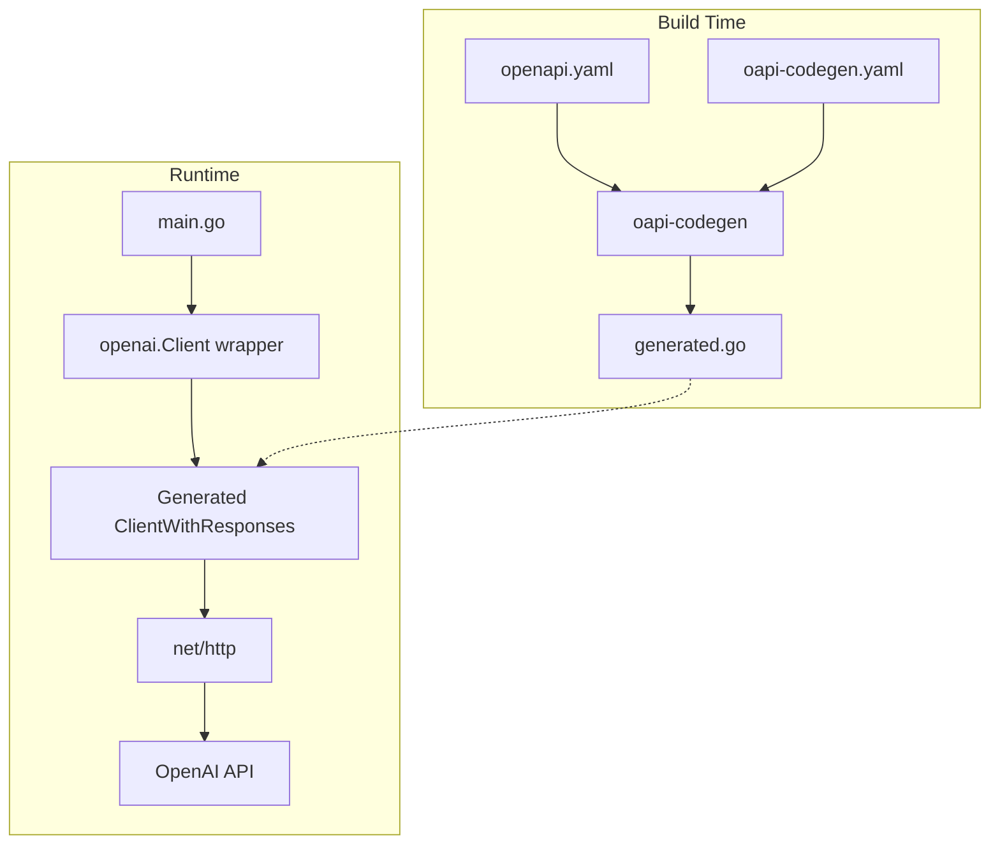

# OpenAPI 3 + oapi-codegen Integration Plan

## Overview

Replace the hand-written OpenAI HTTP client with code generated from an OpenAPI 3 specification using `oapi-codegen`. This approach provides:

- **Type safety**: Generated types match the API specification exactly
- **Maintainability**: Regenerate client when API changes
- **Consistency**: Standard approach used across Go projects
- **Reduced boilerplate**: No manual HTTP request/response handling

## Current State

The project currently has a manually implemented OpenAI client:

```
internal/openai/
├── client.go    # Manual HTTP client with ChatCompletion method
└── types.go     # Hand-written request/response types
```

## Target State

```
internal/openai/
├── openapi.yaml           # Minimal OpenAPI 3 spec for chat completions
├── oapi-codegen.yaml      # Code generation configuration
├── generated.go           # Generated client and types (do not edit)
├── client.go              # Wrapper client using generated code
└── types.go               # REMOVED - replaced by generated types
```

## Architecture Diagram



## Implementation Details

### 1. OpenAPI 3 Specification - openapi.yaml

A minimal spec covering only the chat completions endpoint, derived from the official OpenAI spec:

```yaml
openapi: 3.0.3
info:
  title: OpenAI API - Chat Completions
  version: 1.0.0
  description: Minimal OpenAI API spec for chat completions

servers:
  - url: https://api.openai.com/v1

paths:
  /chat/completions:
    post:
      operationId: createChatCompletion
      summary: Creates a chat completion
      requestBody:
        required: true
        content:
          application/json:
            schema:
              $ref: '#/components/schemas/CreateChatCompletionRequest'
      responses:
        '200':
          description: OK
          content:
            application/json:
              schema:
                $ref: '#/components/schemas/CreateChatCompletionResponse'
      security:
        - bearerAuth: []

components:
  securitySchemes:
    bearerAuth:
      type: http
      scheme: bearer

  schemas:
    # Request and response schemas...
```

### 2. oapi-codegen Configuration - oapi-codegen.yaml

```yaml
package: openai
output: generated.go
generate:
  client: true
  models: true
  embedded-spec: false
output-options:
  skip-prune: false
```

### 3. Generated Code Structure

oapi-codegen will generate:

- **Types**: CreateChatCompletionRequest, CreateChatCompletionResponse, ChatCompletionMessage, etc.
- **Client interface**: ClientInterface with CreateChatCompletion method
- **ClientWithResponses**: Wrapper that parses responses into typed structs

### 4. Wrapper Client - client.go

The wrapper provides a simplified interface matching the current API:

```go
package openai

import (
    "context"
    "fmt"
    "net/http"
    
    "gopus/internal/config"
)

// Client wraps the generated OpenAI client with configuration
type Client struct {
    client *ClientWithResponses
    model  string
    maxTokens int
    temperature float32
}

// NewClient creates a new OpenAI client from configuration
func NewClient(cfg *config.Config) (*Client, error) {
    // Create HTTP client with auth header
    httpClient := &http.Client{...}
    
    // Create generated client
    client, err := NewClientWithResponses(
        cfg.OpenAI.BaseURL,
        WithHTTPClient(httpClient),
    )
    
    return &Client{
        client: client,
        model: cfg.OpenAI.Model,
        ...
    }, nil
}

// ChatCompletion sends a chat completion request
func (c *Client) ChatCompletion(ctx context.Context, messages []ChatCompletionRequestMessage) (*CreateChatCompletionResponse, error) {
    // Use generated client
    resp, err := c.client.CreateChatCompletionWithResponse(ctx, CreateChatCompletionRequest{
        Model: c.model,
        Messages: messages,
        MaxTokens: &c.maxTokens,
        Temperature: &c.temperature,
    })
    
    if err != nil {
        return nil, err
    }
    
    if resp.JSON200 == nil {
        return nil, fmt.Errorf("API error: %s", resp.Status())
    }
    
    return resp.JSON200, nil
}
```

### 5. Changes to main.go

Minimal changes required - update type references:

```go
// Before
history = append(history, openai.Message{Role: "user", Content: input})

// After  
history = append(history, openai.ChatCompletionRequestMessage{Role: "user", Content: input})
```

### 6. go:generate Directive

Add to [`generated.go`](internal/openai/generated.go) or a separate file:

```go
//go:generate go run github.com/oapi-codegen/oapi-codegen/v2/cmd/oapi-codegen --config=oapi-codegen.yaml openapi.yaml
```

## New Dependencies

```go
require (
    github.com/oapi-codegen/oapi-codegen/v2 v2.4.1
    github.com/oapi-codegen/runtime v1.1.1
    gopkg.in/yaml.v3 v3.0.1
)
```

## File Changes Summary

| File | Action | Description |
|------|--------|-------------|
| internal/openai/openapi.yaml | CREATE | OpenAPI 3 spec for chat completions |
| internal/openai/oapi-codegen.yaml | CREATE | Code generation config |
| internal/openai/generated.go | CREATE | Generated client and types |
| internal/openai/client.go | MODIFY | Wrapper using generated client |
| internal/openai/types.go | DELETE | Replaced by generated types |
| main.go | MODIFY | Update type references |
| go.mod | MODIFY | Add oapi-codegen dependencies |
| README.md | MODIFY | Document code generation |

## Execution Steps

1. Create the OpenAPI 3 specification file with chat completions endpoint
2. Create oapi-codegen configuration file
3. Install oapi-codegen tool
4. Generate the client code
5. Refactor client.go to use generated types and client
6. Remove types.go (now generated)
7. Update main.go to use new type names
8. Run go mod tidy to update dependencies
9. Test the application
10. Update documentation

## Benefits of This Approach

1. **Single Source of Truth**: OpenAPI spec defines the contract
2. **Easy Updates**: When OpenAI updates their API, update spec and regenerate
3. **Type Safety**: Compile-time checks for request/response structures
4. **Industry Standard**: oapi-codegen is widely used in Go ecosystem
5. **Minimal Runtime Overhead**: Generated code is efficient

## Risks and Mitigations

| Risk | Mitigation |
|------|------------|
| Generated code complexity | Wrapper client hides complexity |
| Breaking changes in oapi-codegen | Pin version in go.mod |
| OpenAPI spec drift from actual API | Use official OpenAI spec as reference |
